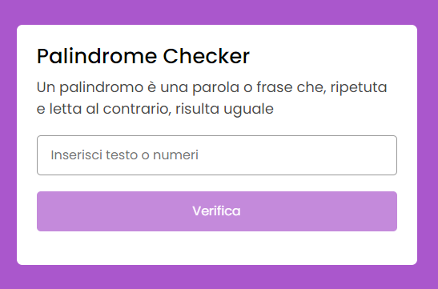
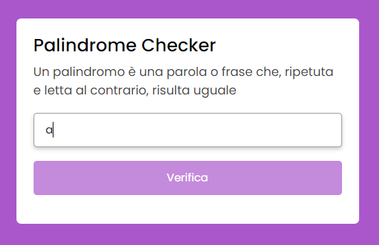
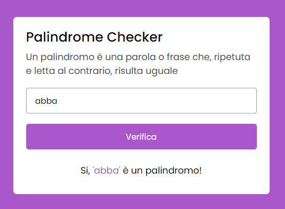
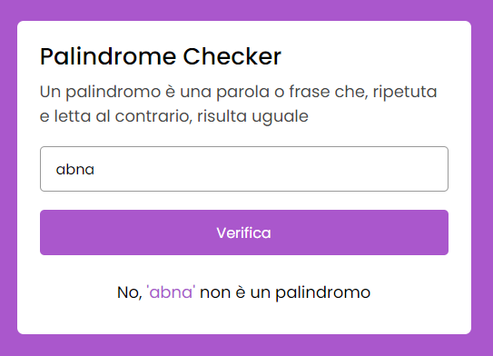

# Progetto Javascript palindrome checker

Progetto molto semplice, in full JS plain, che permette di verificare tramite un controllo se la parola (o il numero) digitato dall'utente nell'input è un palindromo (ovvero una parola, frase, numero che ripetuto al contrario equivale alla versione normale).

- HTML
- CSS
- JAVASCRIPT

Condizione iniziale dell'app

Condizione messa all'utente per verificare se è un palindromo. Ha un minimo di 2 caratteri da digitare

Riscontro in caso di esito positivo

Riscontro in caso di esito negativo

